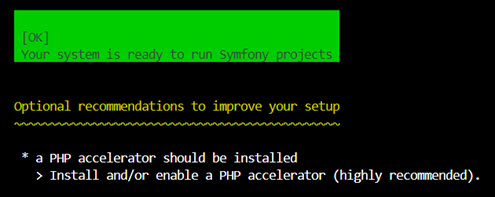

# Codespace PHP avec mariadb

## Arborescence du dépôt

Voici l'arborescence du dépôt et le rôle des différents composants. Les fichiers et dossiers à modifier sont en gras :

├── .devcontainer/ # config du codespace
|  ├── devcontainer.json # Configuration du Dev Container pour VS Code
|  └── Dockerfile # Dockerfile pour construire l'image du Dev Container  dans mariadb 
├── .github/ # config pour les alertes de dépendances (sécurité)
├── .vscode/ 
├── SymfonyElevage # Dossier racine du serveur web
├── start.sh # Script de lancement pour démarrer le service mariadb et les instances web du site et de phpMyAdmin.
└── stop.sh # Script pour arreter le service mariadb et les instances web du site et de phpMyAdmin.


## Configuration du Codespace et lancement de l'application

### Rappel sur les droits sous Linux
Sous Linux, chaque dossier et chaque fichier appartient à un utilisateur et à un groupe et possède des droits.
Ces droits se divisent en trois :
* Les droits pour l'utilisateur propriétaire
* Les droits pour les utilisateurs membres du groupe propriétaire
* Les droits pour tous les autres utilisateurs
 #### Les droits rwx
* _r (read)_ : lire le contenu d'un fichier 
* _w (write)_ : écrire un fichier (nano), écrire dans un dossier (touch)
* _x (execute)_ : exécuter un fichier, entrer dans un dossier (cd)
 #### Exemple
 **```_drwxr-x--- 3 stc friends 4096 mars 31 19:11 .dir_```**
 * Le premier caractère indique que l'élément est un dossier (d) ou un fichier (-).
 * Les trois caractères suivants indiquent les droits de l'utilisateur propriétaire (ici stc a les droits rwx : lire, écrire, parcourir)
 * Les trois caractères suivants indiquent les droits des utilisateur membres du groupe propriétaire (ici les membres de friends ont les droits r-x : lire et parcourir, mais pas écrire)
 * Les trois caractères suivants indiquent les droits des autres utilisateurs (ici --- : aucun droit)
 * Le nombre suivant indique le nombre de sous-dossiers dans le dossier listé (ici .dir a 3 sous-dossiers, dont . et .. donc un seul vrai sous-dossier)
 * La chaîne suivante indique l'utilisateur propriétaire (ici l'utilisateur stc)
 * La chaîne suivante indique le groupe propriétaire (ici le groupe friends)
 * Le nombre suivant indique la taille de l'élément en octets (ici 4096 octets)
 * La chaîne suivante indique la date et l'heure de dernière modification du fichier (ici le 31 mars à 19h11)
 * La dernière chaîne est le nom du fichier (ici .dir)
### Configuration 
Ce dépôt est configuré pour fonctionner avec les Codespaces de GitHub et les Dev Containers de Visual Studio Code. Suivez les étapes ci-dessous pour configurer votre environnement de développement.

!important! 
Pour être executables, les scripts bash executés dans le codespace (start.sh, stop.sh, ...) doivent avoir les bonnes permissions.

1. Utilisez la commande ```ls -l``` pour afficher les permissions des fichiers dans le répertoire contenant vos scripts bash.
Cela affichera les permissions actuelles des fichiers. Les scripts doivent avoir l'autorisation d'exécution (x) pour être exécutables.

2. Ajouter les droits d'exécution
Si les scripts n'ont pas les bonnes permissions, utilisez la commande chmod pour leur ajouter les droits d'exécution :
```chmod +x ./start.sh ./stop.sh ./database/script/*.sh```


### Utilisation avec GitHub Codespaces
1. **Créez un codespace pour ouvrir ce dépot** :
   - Cliquez sur le bouton "Code" dans GitHub et sélectionnez "Open with Codespaces".
   - Si vous n'avez pas encore de Codespace, cliquez sur "New Codespace".

   Le Codespace ainsi créé contient toutes les configurations nécessaires pour démarrer le développement.

### Serveur php, service mariadb (avec la base métier) et les outils symfony (composer et symfony CLI)

1. **Pour lancer les services** :
   - Dans le terminal, exécutez le script `start.sh` :
     ```bash
     ./start.sh
     ```
   Ce script démarre le serveur PHP intégré sur le port 8000, démarre mariadb

   Cet environnement contient **Composer** et **Symfony CLI**. 
   Pour vérifier que tout fonctionne, saisir les commandes suivantes:

      ```bash
      composer --version
      ```
      Puis
      ```bash
      symfony -v
      ```
   Avant de commencer, il est indispensable de vérifier que vous possédez l’environnement nécessaire à la création d’un projet Symfony. Pour cela exécutez la commande suivante à partir d’un terminal de commande :
   ```bash
   symfony check:requirements
   ```
Il est indispensable que la réponse soit OK.

   


  
2. **Ouvrir le service php dans un navigateur pour tester l'accès base de données** :
   - Accédez à `http://localhost:8000` pour voir la page d'accueil de l'application.

3. **Accèder à la BDD** :
   - En mode commande depuis le client mysql en ligne de commande
   Exemple : 
      ```bash
      mysql -u bdElevage-web -p
      ```
        
   - avec phpMyAdmin sur le port 8080   
   - Le mot de passe : elevage-intra

4. **Initialiser la base de données BdElevage** :
   - Au premier démarrage, créez la bdd métier avec le fichier sql
      ```bash
      ./database/script/initBdd.sh 
      ```
