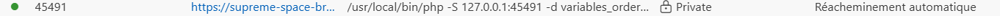
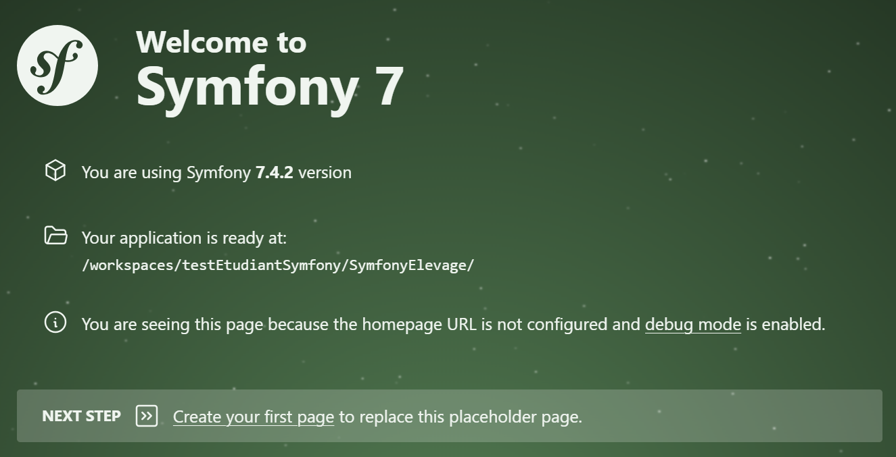
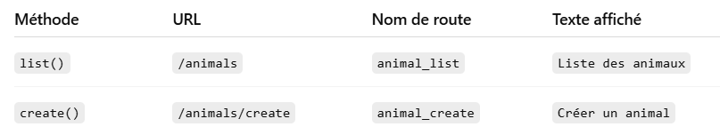
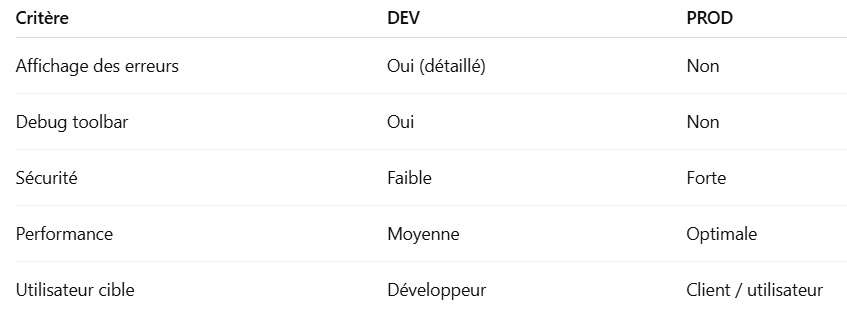
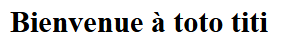

**Le cours symfony se trouve sur l'ENT. La suite concerne uniquement les exercices à réaliser**

# Créer le projet Symfony.
Avant de commencer  **supprimer le dossier SymfonyElevage**

Saisir la commande suivante afin de créer le projet **SymfonyElevage**
```bash
symfony new SymfonyElevage --version=lts --webapp
```
# Lancer le serveur web
Les manipulations suivantes sont à exécuter à chaque lancement du Codespace.
1. Se positionner sur le dossier du projet
Le serveur doit être lancé à partir du dossier qui contient le projet. C'est pour cela qu'il est important de se positionner sur ce dossier en premier.
```bash
cd ./SymfonyElevage/
```
2. Lancer le serveur web

```bash
symfony serve -d
```
Un troisième port est ouvert

Cliquer sur le lien pour ouvrir la page index du projet


3. stopper le servive 
```bash
symfony serve:stop
```
4. Vérifier l'état du service 
```bash
symfony serve:status
```
# Le routage
## Analyse d'une route

Soit le controller suivant:

```
use Symfony\Component\Routing\Attribute\Route;
use Symfony\Bundle\FrameworkBundle\Controller\AbstractController;
use Symfony\Component\HttpFoundation\Response;

class HomeController extends AbstractController
{
    #[Route('/', name: 'home')]
    public function home(): Response
    {
        return new Response('Accueil');
    }
}
```
1. Que représente 
    - ```'/'```
    - ```'home'```
    - ```home()```

2. Créer le controller __*HomeController*__  à l'aide de la commande  ```php bin/console make:controller```
3. quels sont les fichiers créés
4. Afficher la vue concernant la route __'app_home'__
5. Ajouter la route __'home'__ présentée ci-dessus et tester la

## Exercices
### Exo01
Dans le controller __*HomeController*__  ajouter une route ```/elevage``` qui affiche le résultat suivant 
```Bienvenue dans la gestion de l'élevage```
### Exo02
Créer un contrôleur *__AnimalController__* avec le préfixe :
- URL : /animals
- Nom : animal_

Ce contrôleur doit contenir 



### Exo03 - Routes paramétrées
Dans AnimalController, ajouter une route permettant d’afficher un animal par ID.
- URL : /animals/{id}
- nom de la route : animal_show

L'affichage sera le suivant :
```Animal n° X```

Modifier la route afin d'ajouter la contrainte suivante : {id} doit être un entier

### Exo04 - Route avec SLUG
Dans AnimalController, ajouter une route ```/animals/type/{slug}```

**exemples**
``` 
/animals/type/bovin
/animals/type/ovin
``` 
**contraintes**
lettres minuscules + tirets

**Affichage**
``` Type d’animal : bovin``` 

### Exo05 - Préfixe métier
Créer un contrôleur *__BreedingController__* avec le préfixe *breeding*

les routes à créer sont:

- *index()* : affichera ```Gestion de l'élevage```
- feeding() : affichera ```Gestion de l'alimentation```
- health() : affichera ```Suivi sanitaire```

Vous respecterez les conventions de nomages pour les URL et le nom de la route.

### Exo06 - Route avec paramètre optionnel

ajouter une route ```/breeding/report/{year}```

*__les contraintes__*  
- {year} est optionnel
- par défaut: année en cours

# Le moteur de Template Twig
## L'environnement de développement

Par défaut, votre projet est en mode ```dev```. Ce paramétrage se fait dans le fichier ```.env``` à la ligne suivante:

**```APP_ENV=dev```**
Dans Symphony il existe les modes suivants:
-  ```dev``` : pour apprendre et corriger
-  ```prod``` : Livrer proprement
Un site en production doit toujours être en mode ```prod```. Les différences entre ces deux modes sont les suivantes:


La toolbar s'affiche automatiquement en bas de vos vue si vous êtes en mode ```dev``` . Il ne faut pas s'inquiéter. Pour la supprimer et voir le rendu final vous pouvez passer temporairement en mode ```prod``` . Attention à bien revenir en mode ```dev``` pour avoir un détail des erreurs concernant les fonctionnalités que vous développez.


## Analyse d'une route avec une vue Twig
soit la route suivante 

```
     //Première vue Twig
    #[Route('/profil/{nom}/{prenom}', name: 'user_profil')]
    public function profil(string $nom, string $prenom): Response
    {
        return $this->render('home/firstView.html.twig', [
            'nom' => $nom,
            'prenom' => $prenom
        ]);
    }
```
Soit la vue ```firstView.html.twig ``` :
```
<h2>Bienvenue à {{ nom }} {{ prenom }}</h2>
```
### Répondre aux questions:
1. quelle url doit on saisir pour exécuter cette route?
2. Quel est le nom de la route?
Pour Saisir les deux scripts dans le projet Symfony:
1. Je crée ma route dans _______________
2. Je crée ma vue dans le répertoire _____________
3. Mettre en oeuvre cette route et tester la. Le résultat doit être semblable à 



4. modifier la vue et la route pour afficher l'âge en plus du nom et prénom
5. Modifier la vue afin d'afficher le message suivant si l'utilisateur est mineur : "Vous n'avez pas l'autorisation de réserver un animal pour l'adoption"


# TP Symfony : Création d'une interface pour un refuge d'animaux domestiques
## Objectif
Créer une interface web pour un refuge d'animaux domestiques en utilisant **Symfony et Bootstrap**. L'interface devra inclure :
- Un header avec un titre.
- Une barre de navigation avec deux options.
- Deux pages Twig distinctes pour chaque option de la barre de navigation et une page Twig pour l'accueil
- Un footer.

## Structure demandée
### Header
- *Titre* : "Refuge pour animaux domestiques"
- Utiliser une balise ```<header>``` avec une classe Bootstrap pour le style (par exemple, bg-primary text-white p-3).
### Barre de navigation
Utiliser le composant Navbar de Bootstrap. Vous mettrez en place les deux options suivantes :
- **"Gestion des animaux"**:
    - Lien vers une route Symfony (par exemple, ```/animaux```).
    - La page Twig associée affichera dans le ```<body>``` :
    ```
    <h1>Bienvenu sur cette page.</h1>
    <p>Vous allez pouvoir consulter les animaux disponibles à l'adoption.</p>
    ```
- **"Gestion des adoptions"**:
    - Lien vers une route Symfony (par exemple, ```/adoptions```).
    - La page Twig associée affichera dans le ```<body>``` :

    ```
    <h1>Bienvenue au refuge.</h1>
    <p>N'hésitez pas à effectuer une demande d'adoption pour un de nos animaux.</p>

    ```
### footer
- Utiliser une balise ```<footer>``` avec une classe Bootstrap (par exemple, bg-dark text-white p-3).
- Contenu libre (par exemple, copyright, informations de contact).

### Page d'accueil
Elle s'affichera à l'ouverture du site.
 - La page Twig associée affichera dans le ```<body>``` :
    ```
    <h1>Bienvenu Au refuge.</h1>
    <p>Offrez une seconde chance, adoptez un compagnon pour la vie. 
    Ils n’attendent qu’un foyer… et peut-être le vôtre. » </p>
    ```


